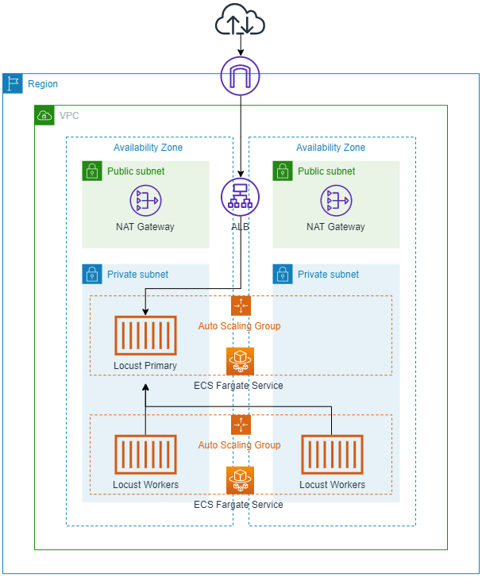

# CDK Locust

This CDK project deploys [Locust](https://locust.io/), an Open Source load tesing framework using [AWS CDK](https://aws.amazon.com/cdk/). This uses CDK in Typescript and is inspired by the [CDK Python Locust project](https://github.com/tynooo/python-cdk-locust).

The this will deploy:
 * Amazon VPC with NAT Gateways
 * ECS on Fargate with two services:
  * Locust Primary - Single Primary (master) container, behind an ALB
  * Locust Workers - Multiple workers (slave) containers (10 by default)
 * VPC Security Group permissions - all necessary secgroups to allow primary/worker communication
 * IAM roles and policies required for running the AWS services
 * AWS CloudMap - for service discovery between primary and workers
 * Locust Containers - built as an asset by CDK from the DockerHub container and stored in ECR

## Architecture Diagram

## Requirements

 * Install [AWS CDK](https://aws.amazon.com/cdk/)
 * Install git
 * Install [NodeJS](https://nodejs.org/en/)
 * Configure your AWS CLI

## Deployment

 * `git clone https://github.com/tomellis/cdk-locust`   clone the repo
 * `cd cdk-locust && npm install`   install npm dependencies
 * `npm run build`   compile typescript to js
 * `cdk synth`       emits the synthesized CloudFormation template
 * `cdk deploy`      deploy this stack to your default AWS account/region
 * `cdk deploy` --require-approval never    deploy the stack without cli nagging you to approve
